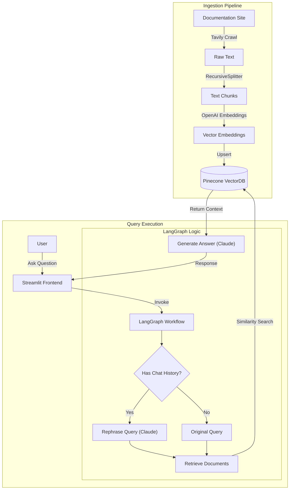

# Documentation Helper

Documentation Helper is an AI-powered application designed to ingest, process, and answer questions based on technical documentation. It leverages a Retrieval-Augmented Generation (RAG) architecture to provide accurate and context-aware responses.

## Overview

This project consists of two main components:
1.  **Ingestion Pipeline**: Automated crawling and indexing of documentation websites.
2.  **RAG Application**: A Streamlit-based interface that allows users to query the indexed documentation using a LangGraph-orchestrated workflow.

## Architecture

The system is built using modern AI stack components including LangChain, LangGraph, OpenAI, Anthropic Claude, Pinecone, and Tavily.

## Detailed Components

### 1. Data Ingestion (`ingestion.py`)
- **Crawling**: Uses `TavilyCrawl` to scrape documentation pages (e.g., LangChain docs).
- **Processing**: Cleans and splits text using `RecursiveCharacterTextSplitter`.
- **Embedding**: Converts text chunks into vectors using `OpenAIEmbeddings` (`text-embedding-3-large`).
- **Storage**: Stores vectors in `PineconeVectorStore` for efficient retrieval.

### 2. Backend Logic (`backend/core.py`)
- **Orchestration**: Uses `LangGraph` to manage the flow of the conversation.
- **Retrieval**: Fetches relevant documents from Pinecone based on user queries.
- **Generation**: Uses `ChatAnthropic` (Claude) to generate natural language responses.
- **History Management**: Rephrases follow-up questions to maintain conversational context.

### 3. Frontend (`main.py`)
- **UI**: A user-friendly Streamlit interface for chatting with the documentation helper.
- **Features**: Displays chat history, source references, and provides a customized user experience.

## Getting Started

1.  **Install Dependencies**: `pip install -r requirements.txt` (or use `uv` / `poetry`).
2.  **Environment Variables**: Set up `.env` with API keys for OpenAI, Pinecone, Tavily, and Anthropic.
3.  **Run Ingestion**: `python ingestion.py` (to populate the vector database).
4.  **Run App**: `streamlit run main.py`.
